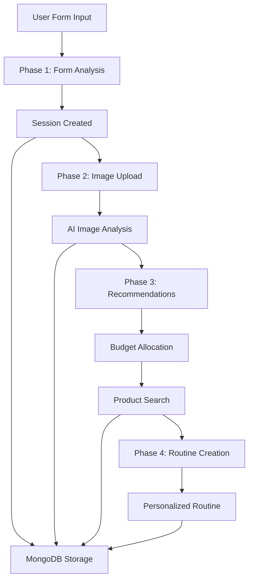

# Seraface AI Server - Repository Summary

## Overview
**Seraface AI Server** is a sophisticated FastAPI-based AI-powered skincare analysis and recommendation system. It provides personalized skincare routines through a comprehensive 4-phase pipeline that combines computer vision, natural language processing, and real-time product data.

## 🏗️ Architecture

### Dual Implementation Structure
The repository contains two parallel implementations:

1. **Legacy API** (`/api/` directory)
   - Original standalone phase endpoints
   - Direct FastAPI routes in separate files (phase1.py, phase2.py, phase3.py, phase4.py)
   - Simplified structure for individual phase testing

2. **Modern Architecture** (`/app/` directory)
   - Professional FastAPI application structure
   - Service-oriented design with proper separation of concerns
   - Router-based organization with comprehensive error handling
   - Database abstraction and configuration management

## 🔄 Core Functionality: 4-Phase AI Pipeline

### Phase 1: Form Data Collection (`/skincare/phase1/form-analysis`)
**Purpose**: Collect comprehensive user skincare information
- **Input**: User form data (skin type, conditions, budget, allergies, goals)
- **Processing**: Data validation and storage
- **Output**: Session ID for tracking user journey
- **Storage**: MongoDB with 90-day expiration
- **Technology**: Pydantic models for validation

**Data Collected:**
- Skin types: oily, dry, combination, normal, sensitive, acne-prone
- Budget range and spending preferences
- Known allergies and product sensitivities
- Previous product experiences (good/bad/neutral)
- Skincare goals and custom objectives

### Phase 2: AI Image Analysis (`/skincare/phase2/image-analysis`)
**Purpose**: Analyze facial images for skin condition assessment
- **Input**: Facial image upload (JPEG, PNG)
- **Processing**: Google Gemini 2.0 Flash computer vision analysis
- **Output**: Structured JSON analysis of skin conditions
- **Technology**: PIL for image processing, Gemini API for AI analysis

**Analysis Capabilities:**
- Acne breakouts (severity, count, location)
- Redness and irritation levels
- Blackheads and whiteheads detection
- Oiliness and shine assessment
- Dryness and flaking analysis
- Uneven skin tone identification
- Dark spots and scarring evaluation
- Pore size analysis
- Hormonal acne indicators
- Fine lines and wrinkles detection
- Skin elasticity assessment

### Phase 3: Product Recommendations (`/skincare/phase3/product-recommendations`)
**Purpose**: Generate personalized product recommendations with budget optimization
- **Input**: Combined form data (Phase 1) + image analysis (Phase 2)
- **Processing**: AI-powered budget allocation and product search
- **Output**: Categorized product recommendations with pricing
- **Technology**: Gemini AI for recommendations, SerpAPI for product search

**Recommendation Process:**
1. **Budget Allocation**: Smart distribution across product categories
   - Tier 1 (Core): Cleanser, Moisturizer, Sunscreen
   - Tier 2 (Treatment): Serums, Spot treatments, Toners
   - Tier 3 (Advanced): Specialized treatments, Premium products
   - Tier 4 (Luxury): High-end and specialized items

2. **Product Search**: Real-time product data via SerpAPI
   - Product prices, ratings, and reviews
   - Store information and availability
   - Product images and descriptions
   - Direct purchase links

3. **Personalization**: AI considers:
   - Skin analysis results
   - User preferences and allergies
   - Budget constraints
   - Previous product experiences

### Phase 4: Routine Creation (`/skincare/phase4/routine-creation`)
**Purpose**: Create personalized skincare routines
- **Input**: Form preferences + product recommendations
- **Processing**: AI-powered routine optimization
- **Output**: Morning and evening skincare routines
- **Technology**: Gemini AI for routine customization

**Routine Features:**
- Step-by-step application instructions
- Product timing and frequency
- Morning vs. evening routine differentiation
- Wait times between products
- Weekly schedule customization
- Ingredient interaction considerations

## 💾 Database Schema

### MongoDB Collections

#### Session Data Collections
- **phase1**: User form data with session tracking
- **phase2**: Image analysis results
- **phase3**: Product recommendations and budget allocation
- **phase4**: Final skincare routines

#### Product Management Collections
- **products_cache**: Cached product data from SerpAPI
- **user_recommended_products**: User-specific product recommendations

### Data Structure
```json
{
  "_id": "session-uuid",
  "session_id": "session-uuid",
  "phase": "phase1|phase2|phase3|phase4",
  "timestamp": "2024-01-01T00:00:00Z",
  "expires_at": "2024-04-01T00:00:00Z",
  "data": { /* phase-specific data */ },
  "version": "1.0"
}
```

## 🔧 Technology Stack

### Backend Framework
- **FastAPI**: Modern, fast web framework for building APIs
- **Uvicorn**: ASGI server for FastAPI applications
- **Pydantic**: Data validation using Python type annotations

### AI & Machine Learning
- **Google Gemini 2.0 Flash**: Advanced multimodal AI for image analysis and recommendations
- **Computer Vision**: Facial image analysis for skin condition detection
- **Natural Language Processing**: Form data interpretation and recommendation generation

### Database & Storage
- **MongoDB**: NoSQL database for flexible document storage
- **Motor**: Asynchronous MongoDB driver for Python
- **Session Management**: UUID-based sessions with automatic expiration

### External APIs
- **SerpAPI**: Real-time product search and pricing data
- **Google Generative AI**: Image analysis and recommendation engine

### Image Processing
- **PIL/Pillow**: Python Imaging Library for image manipulation
- **Base64 encoding**: Secure image transmission

### Development Tools
- **ngrok**: Local development tunneling
- **python-dotenv**: Environment variable management
- **CORS middleware**: Cross-origin request handling

## 📡 API Endpoints

### Skincare Pipeline Endpoints
```
POST /api/v1/skincare/phase1/form-analysis
POST /api/v1/skincare/phase2/image-analysis
POST /api/v1/skincare/phase3/product-recommendations  
POST /api/v1/skincare/phase4/routine-creation
```

### Utility Endpoints
```
GET  /api/v1/skincare/session/{session_id}/status
GET  /api/v1/skincare/forms
GET  /api/v1/skincare/sessions/{session_id}/recommended-products
GET  /api/v1/skincare/products/cache-stats
GET  /api/v1/skincare/products/search
```

### Product Management Endpoints
```
GET    /api/v1/products/
GET    /api/v1/products/{key}
POST   /api/v1/products/
PUT    /api/v1/products/{key}
DELETE /api/v1/products/{key}
```

## 🔄 Data Flow



## 🚀 Key Features

### AI-Powered Analysis
- **Computer Vision**: Advanced facial skin analysis using Gemini 2.0 Flash
- **Personalization**: AI considers individual skin conditions, preferences, and constraints
- **Budget Optimization**: Smart allocation across product categories based on priorities

### Session Management
- **Persistent Sessions**: UUID-based session tracking through all phases
- **Progress Tracking**: Real-time status monitoring and phase completion
- **Data Persistence**: 90-day MongoDB storage with automatic cleanup

### Product Integration
- **Real-time Data**: Live product search via SerpAPI
- **Price Monitoring**: Current pricing, ratings, and reviews
- **Inventory Caching**: MongoDB caching for improved performance
- **Purchase Links**: Direct links to product stores

### Scalable Architecture
- **Service-Oriented Design**: Modular services for easy maintenance
- **Async Processing**: Non-blocking database operations
- **Error Handling**: Comprehensive exception handling and logging
- **API Documentation**: Automatic OpenAPI/Swagger documentation

## 📁 Project Structure

```
Seraface-AI-Server/
├── app/                          # Modern FastAPI application
│   ├── core/                     # Core configuration and database
│   │   ├── config.py            # Application settings
│   │   └── database.py          # MongoDB connection
│   ├── models/                   # Pydantic models
│   │   ├── product_schemas.py   # Product data models
│   │   └── skincare/            # Skincare-specific models
│   ├── routers/                  # API route handlers
│   │   ├── products.py          # Product management routes
│   │   └── skincare.py          # Skincare pipeline routes
│   ├── services/                 # Business logic services
│   │   ├── form_processing_service.py
│   │   ├── image_analysis_service.py
│   │   ├── product_recommendation_service.py
│   │   ├── product_search_service.py
│   │   └── routine_creation_service.py
│   ├── connection_logic.py       # MongoDB data operations
│   └── main.py                   # FastAPI application factory
├── api/                          # Legacy standalone API
│   ├── phase1.py                # Original phase endpoints
│   ├── phase2.py
│   ├── phase3.py
│   ├── phase4.py
│   └── serpapi_immersive.py     # Product search functionality
├── main.py                       # Application entry point
├── requirements.txt              # Python dependencies
└── test_product_search.py       # Integration tests
```

## 🔧 Configuration

### Environment Variables (.env.local)
```env
# Server Configuration
HOST=0.0.0.0
PORT=8000
DEBUG=True
RELOAD=True

# Database Configuration  
MONGO_URI=mongodb://localhost:27017
DATABASE_NAME=seraface
PRODUCTS_COLLECTION=products_cache

# AI Configuration
GEMINI_API_KEY=your_gemini_api_key
SERPAPI_KEY=your_serpapi_key

# ngrok Configuration
NGROK_AUTH_TOKEN=your_ngrok_token
```

## 🏃‍♂️ Getting Started

### Prerequisites
- Python 3.8+
- MongoDB database
- Google Gemini API key
- SerpAPI key (for product search)

### Installation
```bash
# Clone repository
git clone https://github.com/aaronersando/Seraface-AI-Server.git
cd Seraface-AI-Server

# Install dependencies
pip install -r requirements.txt

# Configure environment
cp .env.local.example .env.local
# Edit .env.local with your API keys

# Start application
python main.py
```

### Development
```bash
# Start with auto-reload
uvicorn main:app --reload --host 0.0.0.0 --port 8000

# Run tests
python test_product_search.py
```

## 🔮 Future Roadmap

### Planned Improvements (from code comments)
1. **Algorithm Enhancement**: Build manual product recommendation algorithm based on collected data
2. **Product Classification**: Categorize products by skin type compatibility (oily, dry, etc.)
3. **Price Categorization**: Classify products as cheap, mid-range, expensive
4. **Direct Product Database**: Create internal product database to reduce API dependencies

### Potential Enhancements
- User accounts and authentication
- Routine tracking and progress monitoring
- Product effectiveness feedback system
- Integration with e-commerce platforms
- Mobile app development
- Advanced skin condition tracking over time

## 📊 Current Status

### Functional Components ✅
- Complete 4-phase AI pipeline
- MongoDB data persistence
- Google Gemini AI integration
- SerpAPI product search
- Session management
- RESTful API with documentation
- Error handling and logging

### Areas for Enhancement 🔧
- User authentication system
- Advanced product database
- Performance optimization
- Unit test coverage
- Deployment automation
- API rate limiting

This repository represents a production-ready AI skincare recommendation platform with sophisticated analysis capabilities and real-time product integration.